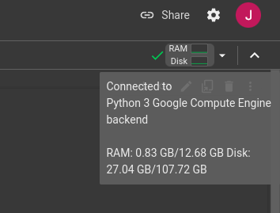

# C1. Utilización de datos de vida real (RWD/RWE) para la Evaluación de Tecnologías Sanitarias (ETS) (RWD4HTA)

---

### - Autor: **Francisco Estupiñan-Romero**, Instituto Aragonés de Ciencias de la Salud (España)
### - Email: <festupinnan@iacs.es>
### - Autor: **Enrique Bernal-Delgado MD PhD**, Instituto Aragonés de Ciencias de la Salud (España)
### - Email: <ebernal@iacs.es>

#### Entidad colaboradora: Red Española de Agencias de Evaluación de Tecnología Sanitarias y Prestaciones del Sistema Nacional de Salud (RedETS)
####  Horario: del miércoles 18 al viernes 20, de 9.00 a 14.00 h

---

¡Bienvenidos al curso! 

Antes de empezar, asegurémonos de que cumplimos los siguientes requisitos:

- Disponer de conexión a Internet.
- Estar conectado con tu cuenta de Google (en caso de no tener instalado Docker).

Si todo es correcto, ¡continuemos! 

--- 

En estos tutoriales, vamos a utilizar Docker o Jupyter Notebook como alternativa.

# Common Data Model Builder

### 🐳 Usuarios con Docker instalado 🐳

Sigue las instruciones de cómo ejecutar con Docker: 

https://github.com/cienciadedatosysalud/cdmb?tab=readme-ov-file#run-in-docker

### 📙 Usuarios sin Docker instalado 📙

El cuaderno está disponible en la siguiente URL:

https://github.com/cienciadedatosysalud/C1-escola-de-salut-publica-menorca/blob/main/c1_tutorial_cdmb.ipynb

🔮🔮🔮 Para abrir el Notebook en Google Colab añade la URL «tocolab» al final de «GitHub». Haz clic en el siguiente enlace 🔮🔮🔮🔮

https://githubtocolab.com/cienciadedatosysalud/C1-escola-de-salut-publica-menorca/blob/main/c1_tutorial_cdmb.ipynb

Una vez estemos en Google Colab, nos aseguramos de estar conectados al backend de Google Compute Engine de Python 3 (parte superior derecha de la pantalla). 

En caso de que no estemos conectados, seleccionamos conectar para obtener un resultado como el de la imagen.

Ahora ya estamos listos para seguir las instrucciones que aparecen en el cuaderno.

# ASPIRE

### 🐳 Usuarios con Docker instalado 🐳

Sigue las instruciones de cómo ejecutar con Docker: 

https://github.com/cienciadedatosysalud/atlas-farmacia?tab=readme-ov-file#1-how-to-run-the-docker

### 📙 Usuarios sin Docker instalado 📙

El cuaderno está disponible en la siguiente URL:

https://github.com/cienciadedatosysalud/C1-escola-de-salut-publica-menorca/blob/main/c1_tutorial_aspire.ipynb

🔮🔮🔮 Para abrir el Notebook en Google Colab añade la URL «tocolab» al final de «GitHub». Haz clic en el siguiente enlace 🔮🔮🔮🔮

https://githubtocolab.com/cienciadedatosysalud/C1-escola-de-salut-publica-menorca/blob/main/c1_tutorial_aspire.ipynb

# Referencias

- Common Data Model Builder (cdmb): https://github.com/cienciadedatosysalud/cdmb
- ASPIRE (Analytic Software Pipeline Interface for Reproducible Execution): https://github.com/cienciadedatosysalud/aspire
- Manual ASPIRE: https://github.com/cienciadedatosysalud/manual_aspire
- ATLAS FARMACIA: https://github.com/cienciadedatosysalud/atlas-farmacia
